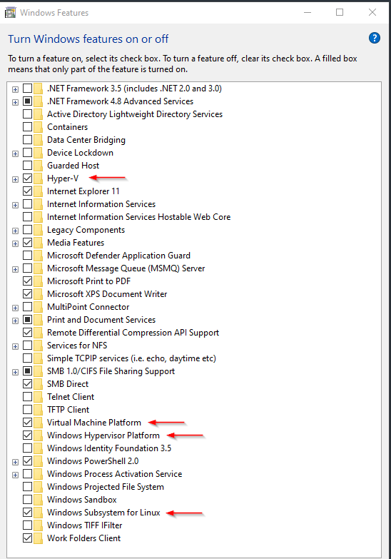
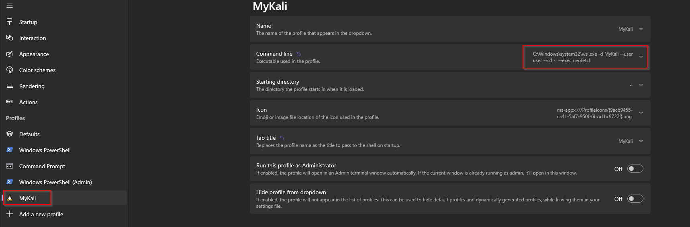
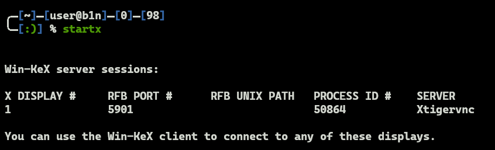

<h1><b>README - MyWSL2<b></h1>

> **Owner** : Mr. Sup3rN0va | 24-May-2022

> **Tags** : #wsl2, #pentesting, #kali

---

## **Installation**

---

- Upgrade to latest version of Windows. Preferably `Windows 11` but I work on `Windows 10 Pro`. `Windows 11` has `GWSL` support
- Make sure no more updates are pending
- Best to install Graphics drivers as well if you have external graphics card because `WSL2` in `Win11` uses `Nvidia CUDA Cores` for rendering
	- NOTE: The support is only for windows 11
- Install [**USBIPd**](https://github.com/dorssel/usbipd-win/releases/latest). This will allow you to connect your physical phone to `WSL2`
- Install `WLS2`: `wsl.exe --install -d kali-linux`
- Go to "Programs and Features" and Enable "HyperV" and other features and reboot

	

- Once rebooted run: 
	- `wsl.exe --shutdown`
	- `wsl.exe --update`
- Git Clone [**MyWSL2**]()
	- `cd MyWSL2`
	- `wsl.exe -u root --exec chmod +x scripts/installFix`
	- `wsl.exe -u root --exec ./scripts/installFix`
- This will update the repos and fix broken packages issues
- Also, this is going to take a very long time to complete so please be patient
- Once the script is completed, run
	- `.\WSL2DR.ps1 -action backup`: Creates backup of the instance
	- `.\WSL2DR.ps1 -action restore`: This will restore from backup
- Once restored, add below command in windows terminal to run kali on a seperate tab, else just type `kali` in powershell
	- `wsl.exe -d MyKali --user user --cd ~ --exec neofetch`

	

- Once inside, run `startx` and this will bring up the GUI

	

- Once installed, `logout` and `login` back
- Type `vim` to install all it's plugins
- At this point, you have two Kali instances, so you can delete the default one with the name `kali-linux`. To remove run:
	- `.\WSL2DR.ps1 -action cleanup`
- Now you have your kali box ready for testing
- Now you can customize your Kali terminal
	- Copy `terminal-customization` from git repo to Kali WSL2
	- Run : 
		- `cd terminal-customization`
		- `chmod +x setup`
		- `./setup`

> NOTE: Sometimes burp or zap inside WSL2 won't capture traffic from mobile. In that case you need to port forward the traffic from your base machine to WSL2. For that, you can run: `.\scripts\WSL2-PortFwd.ps1`

---

☝️ <a href="#">Back to top</a> ☝️

---

## **Reference**

---

- Port Forwarding script is taken from : [**Hray - Using Burpsuite with WSL2**](https://hray.co.uk/2021/02/10/using-burpsuite-with-wsl2/)

---

☝️ <a href="#">Back to top</a> ☝️

---
